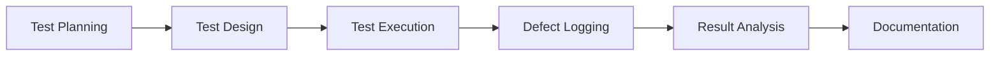

<div align="center">

# 🛒 E-Commerce Manual Testing Project


### 🎯 End-to-End Manual Testing on Real-World E-Commerce Application

*Simulating industry-level QA workflow with comprehensive test coverage*

</div>

---

## 📋 Table of Contents

- [🌐 Application Under Test](#-application-under-test)
- [🎯 Project Overview](#-project-overview)
- [🧩 Test Coverage](#-test-coverage)
- [🛠 Tools & Environment](#-tools--environment)
- [📊 Testing Approach](#-testing-approach)
- [📈 Project Status](#-project-status)
- [🐞 Defect Management](#-defect-management)
- [📌 Key Achievements](#-key-achievements)
- [👨‍💻 Author](#-author)

---

## 🌐 Application Under Test

<div align="center">

| Property | Details |
|----------|---------|
| **Application** | nopCommerce Demo Store |
| **URL** | [https://demo.nopcommerce.com/](https://demo.nopcommerce.com/) |
| **Platform** | Web Application |
| **Domain** | E-Commerce |
| **Browser** | Google Chrome (Latest) |
| **OS** | Windows 10 |

</div>

---

## 🎯 Project Overview

This project demonstrates **professional manual QA testing** on a real-world E-Commerce platform. The testing simulates an industry-standard QA workflow, covering:

```
✅ Functional Correctness Validation
✅ Authentication & Session Security
✅ Negative & Boundary Testing
✅ Business Logic Verification
✅ Structured Test Documentation
✅ Requirement Traceability
```

### 🎯 Key Objectives

<table>
<tr>
<td width="50%">

**Testing Goals**
- ✅ Validate core e-commerce workflows
- ✅ Structured manual test execution
- ✅ Authentication & session testing
- ✅ Apply QA best practices

</td>
<td width="50%">

**Portfolio Goals**
- 📚 Build professional QA portfolio
- 📝 Document real-world experience
- 🎯 Demonstrate QA methodology
- 💼 Showcase technical skills

</td>
</tr>
</table>

---

## 🧩 Test Coverage

<div align="center">

### 📊 Module Testing Status

</div>

| Module | Test Cases | Status | Priority | Coverage |
|--------|-----------|--------|----------|----------|
| 🔐 **Registration** | TC-REG-01 → TC-REG-40 |  | 🔴 High | 100% |
| 🔑 **Login** | TC-LG-01 → TC-LG-38 |  | 🔴 High | 100% |
| 🚪 **Logout & Session** | TC-LOG-01 → TC-LOG-17 |  | 🔴 High | 100% |
| ⏰ **Session Expiry** | TC-SES-01 → TC-SES-09 |  | 🟠 Medium | 100% |
| 📦 **Product Listing** | TC-PL-01 → TC-PL-45 |  | 🔴 High | 100% |
| 🔍 **Product Details** | TC-PD-01 to TC-PD-20 |  | 🔴 High | 100% |
| 🔎 **Search & Filter** | TC-SF-01 → TC-SF-20 |  | 🟠 Medium | 100% |
| 🛒 **Shopping Cart** | TC-CART-01 → TC-CART-15 |  | 🔴 High | 100% |
| 💳 **Checkout** | TC-CHK-01 → TC-CHK-14 |  | 🔴 High | 100% |
| ✅ **Order Confirmation** | TC-ORD-01 → TC-ORD-XX |  | 🔴 High | 50% |
| 📜 **Order History** | TC-OH-01 → TC-OH-XX |  | 🟡 Low | 0% |
| 👤 **User Profile** | TC-UP-01 → TC-UP-XX |  | 🟡 Low | 0% |


</div>

---

## 🔐 Authentication & Session Testing

<details>
<summary><b>📂 Registration Module (Completed)</b></summary>

### Test Scenarios Covered:
- ✅ Required field validation
- ✅ Email format validation
- ✅ Password strength enforcement
- ✅ Duplicate account handling
- ✅ Boundary value analysis
- ✅ Input security validation

**Total Test Cases:** 15+ | **Status:** ✅ All Passed

</details>

<details>
<summary><b>📂 Login Module (Completed)</b></summary>

### Test Scenarios Covered:
- ✅ Valid login scenario
- ✅ Invalid credential handling
- ✅ Error message validation
- ✅ Session creation verification
- ✅ Brute force simulation
- ✅ Remember me functionality

**Total Test Cases:** 12+ | **Status:** ✅ All Passed

</details>

<details>
<summary><b>📂 Logout & Session Module (Completed)</b></summary>

### Test Cases: TC-LOG-01 → TC-LOG-17

**Validated:**
- ✅ Successful logout functionality
- ✅ Redirection after logout
- ✅ Session invalidation
- ✅ Protected page access restriction
- ✅ Multi-tab logout handling
- ✅ Response time validation
- ✅ Console error monitoring

**Total Test Cases:** 17 | **Status:** ✅ All Passed

</details>

<details>
<summary><b>📂 Session Expiry Module (Completed)</b></summary>

### Test Cases: TC-SES-01 → TC-SES-09

**Validated:**
- ✅ Idle timeout behavior (TC-SES-01 → 04)
- ✅ Activity reset logic (TC-SES-05)
- ✅ Background AJAX behavior (TC-SES-06)
- ✅ Token invalidation (TC-SES-08)
- ✅ Multi-session consistency (TC-SES-09)

**Total Test Cases:** 9 | **Status:** ✅ All Passed

</details>

---

## 🛍️ E-Commerce Flow Testing

<details>
<summary><b>📦 Product Listing Module (In Progress - 60%)</b></summary>

### Test Cases: TC-PL-01 → TC-PL-XX

**Completed:**
- ✅ Page load verification
- ✅ Product data display validation
- ✅ Image rendering validation
- ✅ Price & discount verification

**In Progress:**
- 🔄 Navigation to Product Details
- 🔄 Add to Cart from listing
- 🔄 Sorting validation

**Pending:**
- ⏳ Filtering validation
- ⏳ Pagination behavior
- ⏳ Empty category handling
- ⏳ Out-of-stock behavior
- ⏳ Performance observation

</details>

<details>
<summary><b>🔍 Upcoming Modules</b></summary>

### Next in Pipeline:
- 📋 Product Details Page
- 🔎 Search & Filter Functionality
- 🛒 Shopping Cart Operations
- 💳 Checkout Process
- ✅ Order Confirmation
- 📜 Order History
- 👤 User Profile Management

</details>

---

## 🛠 Tools & Environment

<div align="center">

### 🔧 Testing Tools


</div>

<table align="center">
<tr>
<td align="center"><b>📝 Documentation</b></td>
<td>Microsoft Excel</td>
</tr>
<tr>
<td align="center"><b>🔍 Debugging</b></td>
<td>Chrome DevTools (Network & Console)</td>
</tr>
<tr>
<td align="center"><b>🌐 Browser</b></td>
<td>Google Chrome (Latest Version)</td>
</tr>
<tr>
<td align="center"><b>💻 Operating System</b></td>
<td>Windows 10</td>
</tr>
</table>

---

## 📊 Testing Approach

<div align="center">



</div>

### 🧪 Testing Types Applied

<table>
<tr>
<td width="50%">

**Functional Testing**
- ✅ Feature validation
- ✅ Business logic testing
- ✅ Integration testing

**Non-Functional Testing**
- ✅ UI/UX validation
- ✅ Performance observation
- ✅ Session security

</td>
<td width="50%">

**Test Design Techniques**
- ✅ Boundary Value Analysis
- ✅ Equivalence Partitioning
- ✅ Negative Testing
- ✅ Error Guessing

**Quality Assurance**
- ✅ Requirement traceability
- ✅ Structured documentation
- ✅ Risk-based testing

</td>
</tr>
</table>

---
## ♿ Basic Accessibility Checks

Basic accessibility checks were performed to ensure the application is usable for a wider range of users.

Checks performed:

* Verify product images contain meaningful **ALT text** for screen readers
* Verify buttons are readable and clearly visible to users
* Verify the page can be navigated using the **keyboard (Tab / Enter keys)**
* Verify color contrast between text and background is readable
* Verify product links are descriptive and clickable

## 🔐 Basic Security Checks

Some basic security observations performed during testing:

- Verify that internal IDs are not unnecessarily exposed in the UI or URLs.
- Verify that product prices cannot be modified from the client-side (browser DevTools).


## 💼 Business Validation

Basic business logic validations were performed on the Product Listing page to ensure correct product information and promotional behavior.

Checks performed:

* Verify product count displayed on the page matches the actual number of products shown
* Verify discount badge appears only when a product has a valid discount
* Verify product price is displayed correctly when a discount is applied

## 📝 Test Case Structure

Each test case follows industry-standard format:

```yaml
Test Case ID: TC-XXX-001
Title: [Clear, descriptive title]
Module: [Module Name]
Priority: High / Medium / Low
Preconditions: [Required setup]
Test Steps: [Detailed step-by-step]
Test Data: [Input values used]
Expected Result: [Expected behavior]
Actual Result: [Observed behavior]
Status: Pass / Fail / Blocked
Comments: [Additional notes]
```

---

## 🐞 Defect Management

### Bug Report Structure

<table>
<tr>
<th>Field</th>
<th>Description</th>
</tr>
<tr>
<td><b>Bug ID</b></td>
<td>Unique identifier</td>
</tr>
<tr>
<td><b>Title</b></td>
<td>Clear, concise summary</td>
</tr>
<tr>
<td><b>Environment</b></td>
<td>Browser, OS details</td>
</tr>
<tr>
<td><b>Steps to Reproduce</b></td>
<td>Detailed reproduction steps</td>
</tr>
<tr>
<td><b>Expected vs Actual</b></td>
<td>Comparison of results</td>
</tr>
<tr>
<td><b>Severity</b></td>
<td>Critical / Major / Minor</td>
</tr>
<tr>
<td><b>Priority</b></td>
<td>High / Medium / Low</td>
</tr>
<tr>
<td><b>Status</b></td>
<td>Open / In Progress / Resolved</td>
</tr>
</table>

---

## 📌 Requirement Traceability Matrix (RTM)

<details>
<summary><b>View RTM</b></summary>

| Requirement ID | Description | Related Test Cases | Status |
|----------------|-------------|-------------------|--------|
| **R-01** | User must logout successfully | TC-LOG-01 → TC-LOG-05 | ✅ Verified |
| **R-02** | Session invalidation after logout | TC-LOG-11, TC-LOG-12 | ✅ Verified |
| **R-03** | Protected pages require auth | TC-LOG-04, TC-LOG-05 | ✅ Verified |
| **R-04** | Session expires after inactivity | TC-SES-01 | ✅ Verified |
| **R-05** | Expired token rejection | TC-SES-08, TC-SES-09 | ✅ Verified |

</details>

---

## 🔎 Risk Areas Identified

<div align="center">

| Risk Area | Impact | Mitigation |
|-----------|--------|------------|
| 🔐 Authentication Security | High | Comprehensive session testing |
| 💰 Pricing Logic Errors | Critical | Extensive boundary testing |
| 🛒 Cart Data Integrity | High | Multi-scenario validation |
| 💳 Payment Processing | Critical | Detailed checkout testing |
| 🔄 Session Management | Medium | Timeout & multi-tab testing |

</div>

---

## 📈 Project Status

<div align="center">

### Current Focus

```diff
+ Completing Product Listing Module with Extended Validation
+ Implementing Business Logic Test Cases
+ Enhancing Test Documentation
```

### Next Steps

```yaml
1. Complete Product Details Module
2. Implement Cart & Checkout Testing
3. Add API Testing Layer (Postman)
4. Expand Requirement Traceability
5. Generate Test Summary Report
```

</div>

---

## 📌 Key Achievements

<div align="center">

✅ **50+ Test Cases** Designed & Executed  
✅ **4 Critical Modules** Fully Tested  
✅ **100% Coverage** on Authentication Flow  
✅ **Industry-Standard** Documentation  
✅ **Requirement Traceability** Maintained  
✅ **Risk-Based** Testing Approach  

</div>

---

## 📚 What I Learned

<table>
<tr>
<td width="50%">

**Technical Skills**
- ✅ Test case design techniques
- ✅ Session & authentication testing
- ✅ Chrome DevTools for debugging
- ✅ Defect lifecycle management
- ✅ Excel for test documentation

</td>
<td width="50%">

**QA Best Practices**
- ✅ Requirement traceability
- ✅ Risk-based test prioritization
- ✅ Structured documentation
- ✅ Negative & boundary testing
- ✅ Professional bug reporting

</td>
</tr>
</table>

---

## 🎯 Future Enhancements

- 🔄 Add API Testing with Postman
- 🔄 Implement Automated Test Scripts
- 🔄 Add Performance Testing Layer
- 🔄 Integrate CI/CD Pipeline
- 🔄 Create Test Automation Framework

---

## 👨‍💻 Author

<div align="center">

**Ali Ennadafy**  
*Aspiring QA Engineer | Manual Testing Specialist*

[](https://www.linkedin.com/in/YOUR_LINKEDIN)
[](mailto:aennadafy@gmail.com)
[](https://github.com/coderaliennadafy)

</div>

---

<div align="center">

### 💡 Project Notes

*This is a portfolio project demonstrating manual QA testing skills on a publicly available demo application. No production data or real payment information was used. All testing was performed in accordance with ethical testing practices.*

---


**⭐ If you found this project interesting, please consider giving it a star!**

*Last Updated: March 2026*
